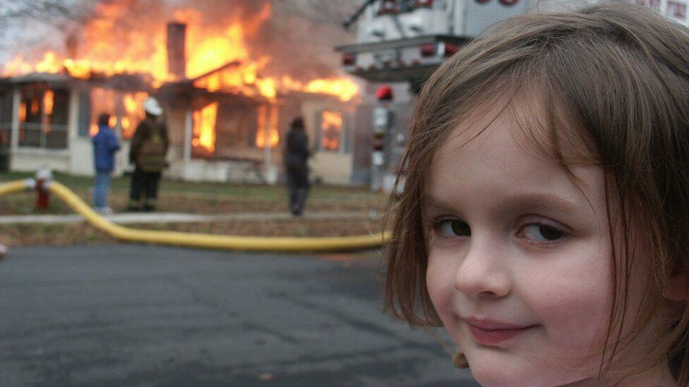

# pearl

 Team : ปลาดาวไม่ใช่ปลา  
CodeArcade : year2 / term2  
DateStart : 13/2/2022  
DateUpdated : 15/2/2022  
Score : 30 

# Installed
    cd 
    git clone https://github.com/zergreen/pearl.git

# Round1

 รอบที่ 1 เหลือข้อที่ 3 ที่ยังไม่ได้ 

[โปรเจคนี้เป็นการสำรองไฟล์ใน code arcade ลงกิตฮับ]

<!--  -->

<!-- ; -->
